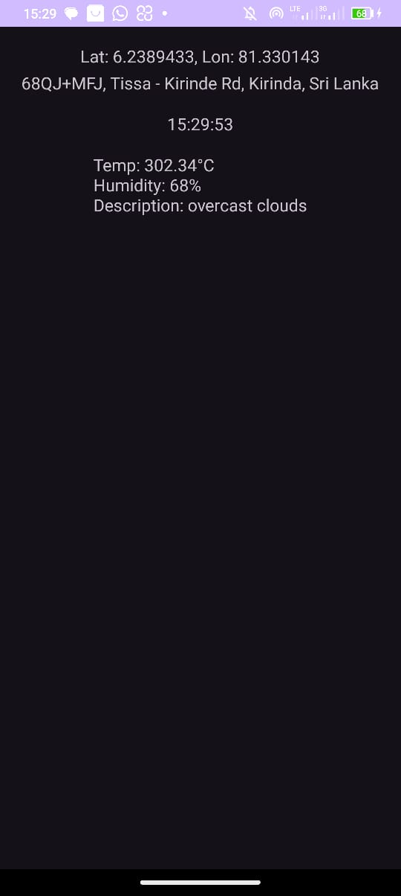

<h1>Weather App</h1>
<p>WeatherApp is an Android application that provides current weather information based on the user's location. The app utilizes the OpenWeatherMap API to fetch weather data and displays it along with the user's location and the current time.
Features</p>
<ul>
  <li>Location Detection: Automatically fetches the user's current location using the device's GPS.</li>
  <li>Current Weather: Displays the current temperature (in Celsius), humidity, and weather description.</li>
  <li>Address Information: Shows the user's current address based on the detected location.</li>
  <li>Current Time: Displays the current time.</li>
</ul>

<h2>Screenshots</h2>



<h2>Installation</h2>

1. **Clone the Repository:**
   
   ```sh
   git clone https://github.com/yourusername/WeatherApp.git

2. **Open in Android Studio:**
   - **Open Android Studio.**
   - **Select "Open an existing project".**
   - **Navigate to the cloned repository folder and open it.**
  
3 **Add API Key:**
  - **Obtain your API key from OpenWeatherMap.**
  - **Open MainActivity.java and replace the placeholder API_KEY with your actual API key.**

    ```sh
    private static final String API_KEY = "your_api_key_here";

4. **Run the App:**
   - **Connect your Android device or start an emulator.**
   - **Click the "Run" button in Android Studio.**

<h2>Usage</h2>

Upon launching the app, it will request location permissions. Once granted, the app will automatically detect your current location and display the weather information, address, and current time.
Permissions

The app requires the following permissions:

  - **ACCESS_FINE_LOCATION and ACCESS_COARSE_LOCATION for location detection.**
  - **INTERNET for fetching weather data from the OpenWeatherMap API.**

Ensure these permissions are declared in the AndroidManifest.xml file:

```sh
<uses-permission android:name="android.permission.ACCESS_FINE_LOCATION"/>
<uses-permission android:name="android.permission.ACCESS_COARSE_LOCATION"/>
<uses-permission android:name="android.permission.INTERNET"/>
```

<h2>Dependencies</h2>

The app uses the following libraries:

  - **Retrofit: For making API requests.**
  - **Gson: For JSON parsing.**
  - **Google Play Services Location: For location services.**

Add these dependencies to your build.gradle file:

```sh
dependencies {
    implementation 'com.google.android.gms:play-services-location:21.0.1'
    implementation 'com.squareup.retrofit2:retrofit:2.9.0'
    implementation 'com.squareup.retrofit2:converter-gson:2.9.0'
}
```

<h2>Acknowledgments</h2>

- **OpenWeatherMap for providing the weather API.**
- **Retrofit and Gson for making API integration easier.**
- **Google Play Services for location services.**


    
    
    
    
